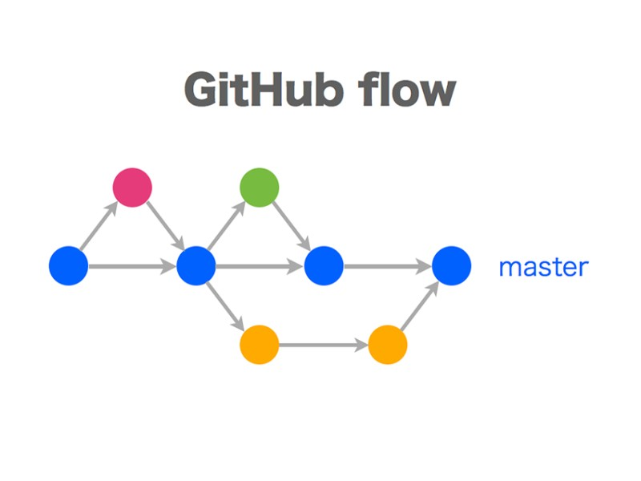

# Ветвление

### <ins>Ветвление</ins> - это создание различных версий репозиториев, отличных друг от друга. Это необходимо когда нужно ввести процесс разработки определённый функционал.

### Схематический пример одного из видов ветвления:

